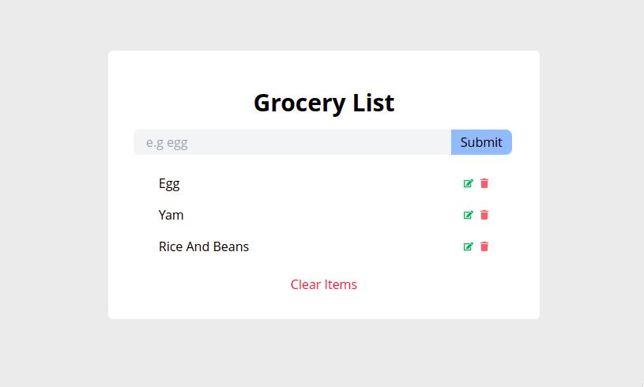

# Grocery List

> This is a react application used as a practicing project to become better in react and tailwindcss.
> In the app, use can add groceries to the lists, edit, remove single grocery, and clear all the added groceries 



## ⚒️  Built with

- Html
- Css
- JavaScript
- React

## 🎞️ Frameworks and Technologies used

- Tailwindcss
- HTML
- CSS
- JavaScript
- ReactJS

## 🖥️ Live Demo
- [Netlify](https://qoosim-meal-reviews-refactor.netlify.app/) :point_left:

## Getting Started

To get a local copy up and running on your machine, follow these simple steps.
Enter this in your terminal 👇 
``` 
  git clone git@github.com:Qoosim/meal-reviews-refactor-react.git
``` 
## 🛠️ Prerequisites
```
  Install Node.js on your machine
```
## 🕹️ Setup
```
  Clone the repository on your machine and cd into it
  run npm install
  run npm run start
```
## Author

👤 **Qoosim AbdulGhaniyy**

- GitHub: [Qoosim](https://github.com/Qoosim)
- LinkedIn: [Qoosim](https://www.linkedin.com/in/qoosim)

## 🤝 Contributing

Contributions, issues, and feature requests are welcome!

Feel free to check the [issues page](../../issues/).

## Show your support

Give a ⭐️ if you like this project!

## Acknowledgments

- To those assist in understanding the concept of React 

## 📝 License

This project is [MIT](./MIT.md) licensed.

